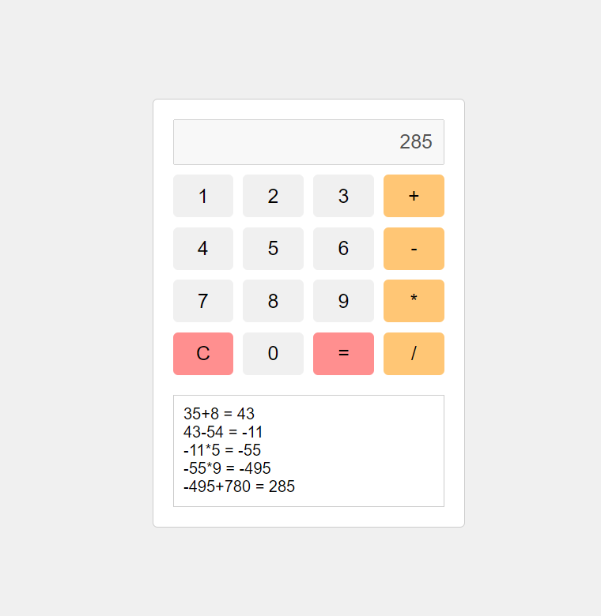

# Calculator Project

This project is a simple web-based calculator, created as part of the BeCode training program. It's designed using pure HTML, CSS, and JavaScript, and takes inspiration from the Google Calculator's design.

## Features

- **Simple Style:** The calculator has a clean, user-friendly interface, mimicking the Google Calculator style.
- **Display Field:** It features a display field where your calculations are shown in real-time.
- **History Field:** There's also a history field that stores your previous calculations, allowing you to refer back to them at any time.

## Focus

The primary focus of this project is to consolidate our JavaScript skills. Throughout the development of this calculator, we've practiced and deepened our understanding of JavaScript's core features and concepts.

## Live 
The project is deployed on Netlify. Feel free to [play with it. ](https://simple-calculator-sf.netlify.app/)

## Preview 

